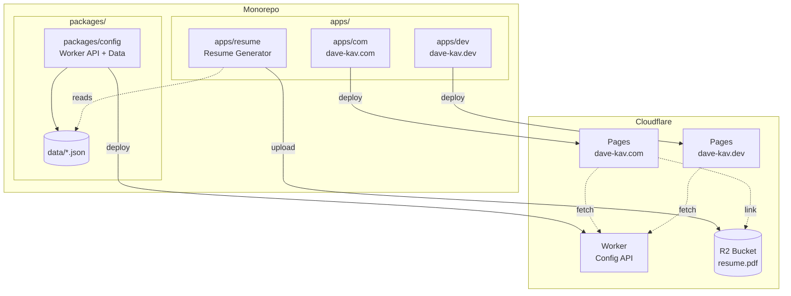
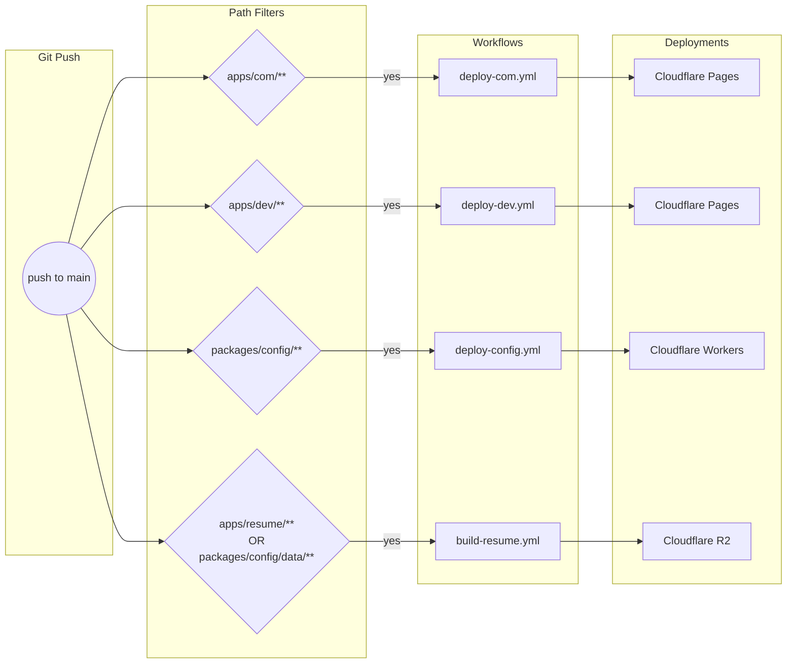

# dave-kav-portfolio

Monorepo containing all portfolio sites and supporting infrastructure.

## Architecture



## CI/CD Workflow



## Structure

```
dave-kav-portfolio/
├── apps/
│   ├── com/              # dave-kav.com - Main portfolio site
│   ├── dev/              # dave-kav.dev - Terminal-style site
│   └── resume/           # LaTeX resume generator
├── packages/
│   └── config/           # Cloudflare Worker API + shared data
│       ├── data/         # JSON config files (experience, education, etc.)
│       └── src/          # Worker source code
└── .github/workflows/    # Path-filtered CI/CD workflows
```

## Data Flow

| Source | Consumer | Method |
|--------|----------|--------|
| `packages/config/data/*.json` | `apps/com` | Runtime fetch from Worker API |
| `packages/config/data/*.json` | `apps/dev` | Runtime fetch from Worker API |
| `packages/config/data/*.json` | `apps/resume` | Direct file read at build time |

## Development

```bash
# Install dependencies
pnpm install

# Run dave-kav.com locally
pnpm dev:com

# Run dave-kav.dev locally
pnpm dev:dev

# Run config worker locally
cd packages/config && pnpm dev

# Generate resume
cd apps/resume && node scripts/generate.js
```

## Workflows

| Workflow | Triggers On | Deploys To |
|----------|-------------|------------|
| `deploy-com.yml` | `apps/com/**` | Cloudflare Pages (dave-kav-com) |
| `deploy-dev.yml` | `apps/dev/**` | Cloudflare Pages (dave-kav-dev) |
| `deploy-config.yml` | `packages/config/**` | Cloudflare Workers |
| `build-resume.yml` | `apps/resume/**`, `packages/config/data/**` | Cloudflare R2 |

## Secrets Required

- `CLOUDFLARE_API_TOKEN` - Cloudflare API token with Pages/Workers/R2 permissions
- `CLOUDFLARE_ACCOUNT_ID` - Cloudflare account ID

## URLs

- **dave-kav.com**: https://dave-kav.com
- **dave-kav.dev**: https://dave-kav.dev
- **Config API**: https://dave-kav-portfolio-config.davykav87.workers.dev
- **Resume PDF**: https://e176e82e7e125f4726a76dd364ecb66b.r2.cloudflarestorage.com/dave-kav-resume/resume.pdf
