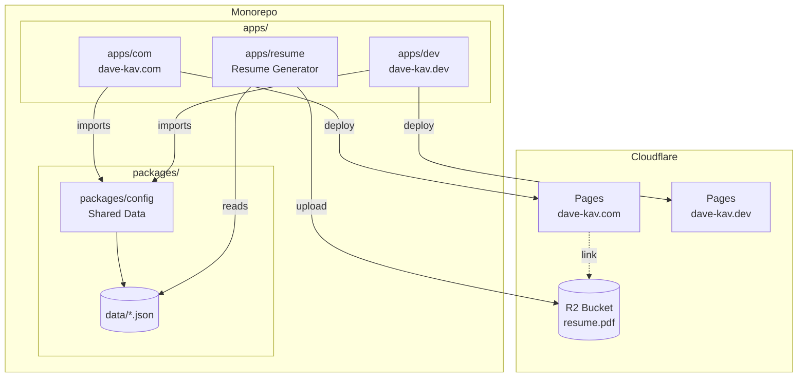
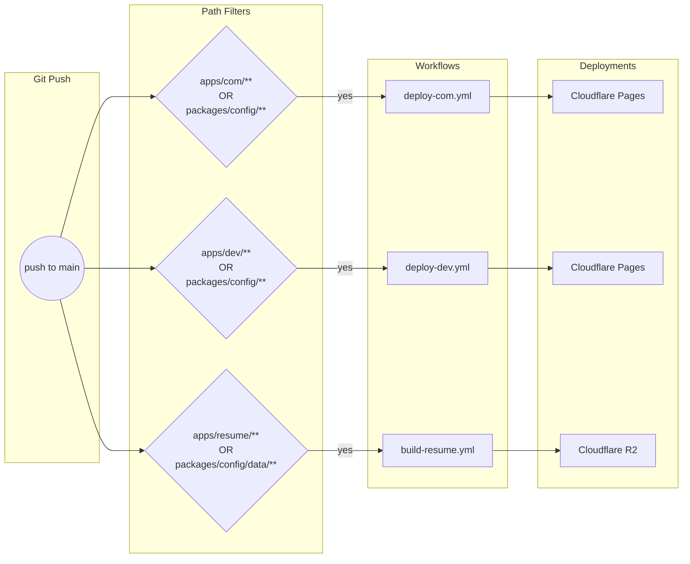

# dave-kav-portfolio

Monorepo containing all portfolio sites and supporting infrastructure.

## Architecture



## CI/CD Workflow



## Structure

```
dave-kav-portfolio/
├── apps/
│   ├── com/              # dave-kav.com - Main portfolio site
│   ├── dev/              # dave-kav.dev - Terminal-style site
│   └── resume/           # LaTeX resume generator
├── packages/
│   └── config/           # Shared config data
│       ├── index.ts      # Exports all data + types
│       └── data/         # JSON config files
└── .github/workflows/    # Path-filtered CI/CD workflows
```

## Data Flow

All apps import config data directly at **build time** via the `@dave-kav/config` workspace package:

```typescript
import { experienceData, educationData } from '@dave-kav/config';
```

This approach:
- Eliminates runtime API calls
- Bakes data into the build for faster page loads
- Automatically rebuilds sites when config changes (via path filters)

## Development

```bash
# Install dependencies
pnpm install

# Run dave-kav.com locally
pnpm dev:com

# Run dave-kav.dev locally
pnpm dev:dev

# Generate resume
cd apps/resume && node scripts/generate.js
```

## Workflows

| Workflow | Triggers On | Deploys To |
|----------|-------------|------------|
| `deploy-com.yml` | `apps/com/**`, `packages/config/**` | Cloudflare Pages |
| `deploy-dev.yml` | `apps/dev/**`, `packages/config/**` | Cloudflare Pages |
| `build-resume.yml` | `apps/resume/**`, `packages/config/data/**` | Cloudflare R2 |

**Key behavior:** Changing `packages/config/data/*.json` triggers rebuilds of both sites AND the resume.

## Secrets Required

- `CLOUDFLARE_API_TOKEN` - Cloudflare API token with Pages/R2 permissions
- `CLOUDFLARE_ACCOUNT_ID` - Cloudflare account ID

## URLs

- **dave-kav.com**: https://dave-kav.com
- **dave-kav.dev**: https://dave-kav.dev
- **Resume PDF**: https://e176e82e7e125f4726a76dd364ecb66b.r2.cloudflarestorage.com/dave-kav-resume/resume.pdf
